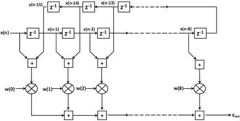
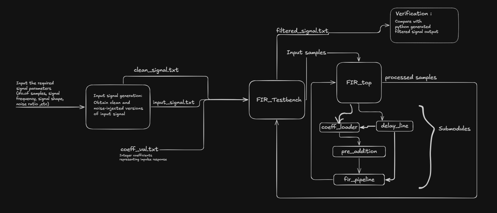
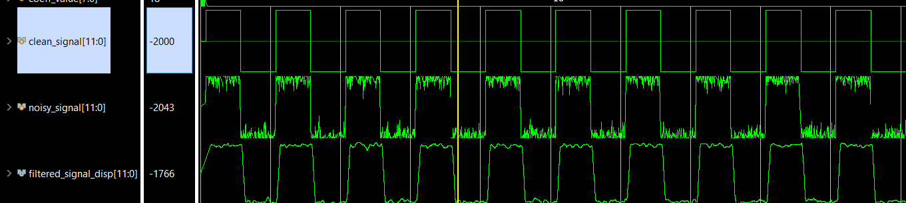
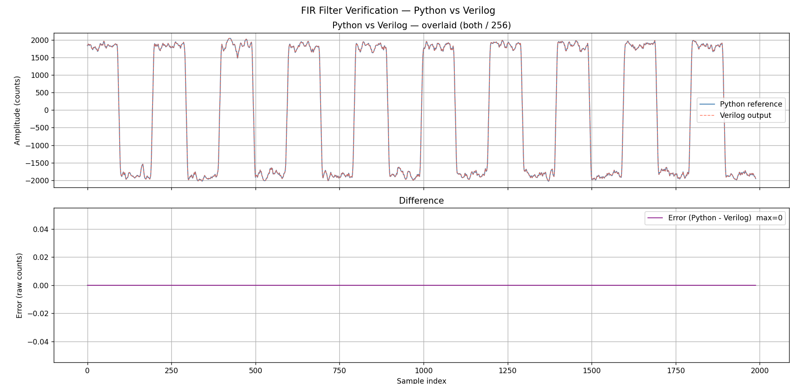

# Symmetric Pipelined FIR Filter — RTL Implementation

A 12-tap symmetric low-pass FIR filter implemented in Verilog with a 3-stage pipeline datapath.  
Verified through RTL simulation in Vivado and a Python reference model.

---
## Repository Structure

```text
├── docs/
│   ├── block_digram.png  
│   ├── py_comparison.png    
│   ├── vivado_waveform.png     
│
├── rtl/
│   ├── symmetricFIR.v    
│   ├── coeff_loader.v    
│   ├── delay_line.v      
│   ├── pre_adder.v       
│   └── fir_pipeline.v    
│
├── sim/
│   └── symmetricFIR_tb.v 
│
├── scripts/
│   └── gen_noisy_sig.py  
│
├──.gitignore
│
└── README.md
```

---
## Filter Specifications

| Parameter | Value |
|---|---|
| Filter type | Symmetric FIR, low-pass |
| Taps | 12 (stored as 6 due to symmetry) |
| Coefficients (half) | `[6, 12, 22, 30, 34, 24]` |
| Full symmetric filter | `[6,12,22,30,34,24,24,34,30,22,12,6]` |
| DC gain | 256 = 2⁸ |
| Cutoff frequency | ~60 Hz |
| Input width | 12-bit signed |
| Output width | 26-bit signed |
| Clock | 100 MHz |
| Pipeline stages | 3 |
| Pipeline latency | 15 clocks |

---

## Architecture
The complete FIR filter is implemented as a top-level module (symmetricFIR) that instantiates four sub-modules connected in a pipeline chain. The block diagram shows the flow from coefficient loading through sample delay, pre-addition, and finally the pipelined multiply-accumulate stage.



### Block Diagram


### Pipeline Datapath

Pre-adder addition -> Multiplication with impulse response -> Accumulation 
| Stage | Module | Operation | Latency |
|---|---|---|---|
| 1 | `pre_adder` | `sum[j] = x[j] + x[11-j]` | 1 clock |
| 2 | `fir_pipeline` | `mul[j] = sum[j] × h[j]` | 1 clock |
| 3 | `fir_pipeline` | `out = Σ mul[j]` | 1 clock |

Symmetry exploitation halves the multiplier count from 12 to 6.  
DC gain = 256 = 2⁸ — output amplitude recovered exactly by `>>> 8` (right shift, no division needed).

---

## Bit Width Chain
```
DATA_WIDTH   = 12  (input)
STAGE1_WIDTH = 13  (+1 for symmetric pair addition carry)
STAGE2_WIDTH = 22  (13 + 8 + 1 for signed multiply)
STAGE3_WIDTH = 26  (22 + ⌈log₂6⌉ + 1 for accumulation)
OUTPUT_WIDTH = 26
```
---

## How to Run

### Prerequisites
- Vivado 2025.1.1 or later (simulation only, no synthesis constraints needed)
- Python 3.x with `numpy` and `matplotlib`

### Step 1 — Generate stimulus files

```bash
cd scripts
py gen_noisy_sig.py
```

Enter parameters when prompted (recommended: 1000 samples, 10 Hz, noise 0.3, square).  
This produces:
- `input_noisy_signal.txt` — noisy input (hex, 12-bit 2's complement)
- `input_clean_signal.txt` — clean reference (hex)
- `coeff_val.txt` — filter coefficients (decimal)
- `python_reference.txt` — frozen Python filter output for later comparison

### Step 2 — Run simulation in Vivado

Add all `.v` files from `rtl/` and `sim/` to a Vivado project.  
In the Tcl console before running simulation:

```tcl
cd {/absolute/path/to/scripts}
```

The `.txt` files must be in the folder you `cd` to — they are read by `$fopen` at runtime, not added as Vivado sources.

Run simulation for at least **1 ms**.  
This produces `filtered_signal.txt` in the same folder.

### Step 3 — Verify against Python reference

```bash
py gen_noisy_sig.py --compare
```
No parameters needed — loads the frozen `python_reference.txt` and compares against `filtered_signal.txt`.  
Expected output:
```python
Latency offset   : 11 samples
Samples compared : 1989
Mismatches       : 0
PASS: Python reference matches Verilog output exactly.
```
---

## Waveform Setup

Add these signals in Vivado, all set to **Analog / Signed Decimal**:

| Signal | Range | Description |
|---|---|---|
| `noisy_signal` | −2100 to 2100 | Noisy input fed to DUT |
| `clean_signal` | −2100 to 2100 | Clean reference (**set style to Analog Step** in case of square shape) |
| `filtered_signal_disp` | −2100 to 2100 | Filter output scaled back to input range |


### Expected Waveform

---

## Python Verification

### Expected Comparison Plot


The comparison plots:
1. **Overlaid** — Python reference and Verilog output on the same axis (both ÷ gain of 256). Should be matching.
2. **Difference** — `Python − Verilog` sample by sample. Should be flat at zero .

Python's convolution produces a longer output than Verilog does.When Python runs np.convolve(signal, h, mode='full'), it zero-pads the signal at both ends and produces an output of length N + L - 1, where N = number of input samples (2000) and L = filter length (12). That gives 2011 output samples.Verilog, however, only outputs samples while real input data is being streamed. Once the last input sample enters the delay line, the Verilog simulation ends, it never zero-pads. So Verilog produces exactly 2000 valid outputs. This boundary mismatches at both ends are trimmed out within the comparison function itself .

## References

- Proakis & Manolakis — *Digital Signal Processing*
- Xilinx UG901 — Vivado Design Suite User Guide: Synthesis
